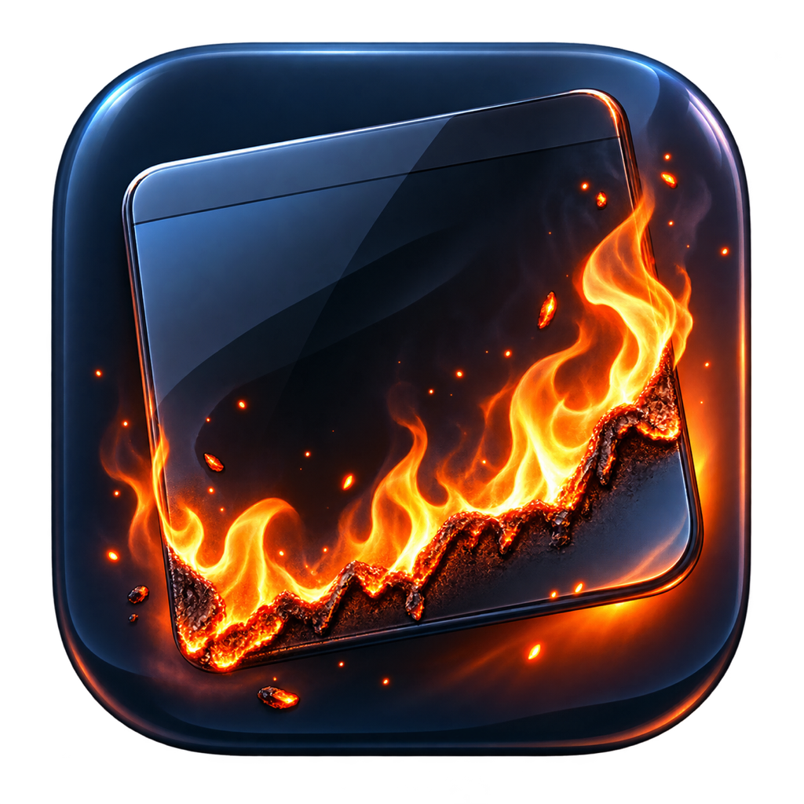
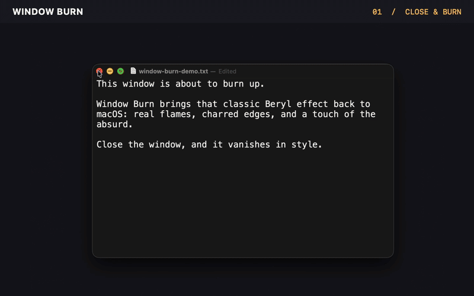

<p align="center">
  
</p>

<h1 align="center">Window Burn</h1>

<p align="center">
  Burn macOS windows out of existence with native Metal effects inspired by Beryl and Compiz.
</p>

Window Burn is a small menu bar utility that brings the gloriously unnecessary window effects
of the Linux desktop's golden age to modern macOS. Close a window normally, ignite it with an
animated torch, or soak it first for the full two-act treatment.

## Demo

<p align="center">
  <a href="docs/window-burn-demo.mp4">
    
  </a>
</p>

<p align="center">
  Close and burn · Torch · Soak and burn<br>
  <a href="docs/window-burn-demo.mp4">Watch the full-quality MP4</a>
</p>

> [!CAUTION]
> Window Burn means it. When a document asks whether to save unsaved changes, the app
> automatically chooses **Delete / Don't Save** before starting the effect. Those changes
> cannot be recovered. Use it only on windows you genuinely want to destroy.

## Install

Requires macOS 14 Sonoma or newer. The release is universal for Apple Silicon and Intel Macs.

```bash
brew install --cask alexrett/tap/window-burn
```

If Homebrew had already cached `alexrett/tap` before this cask was published, run `brew update`
once and retry the install.

You can also download `WindowBurn.dmg` from the
[latest GitHub release](https://github.com/alexrett/window-burn/releases/latest).

On first launch, grant Window Burn these permissions in **System Settings → Privacy & Security**:

- **Accessibility** — closes the selected window and recognizes standard window controls.
- **Screen Recording** — captures the window snapshot used by the effect.
- **Input Monitoring** — detects close-button clicks and interactive torch gestures.

The Screen Recording permission may not display a system prompt. If Window Burn is missing from
that list, add it manually:

1. Open **System Settings → Privacy & Security → Screen & System Audio Recording**
   (called **Screen Recording** on some macOS versions).
2. Click **+**, choose `/Applications/Window Burn.app`, and enable it.
3. Quit and reopen Window Burn.

Restart Window Burn after changing any of the three permissions.

## Effects

| Mode | Shortcut | What it does |
| --- | --- | --- |
| Burn & Close | `⌃⌥⌘B` | Closes the front window and burns its snapshot from a randomized edge. |
| Torch | `⌃⌥⌘F` | Turns the cursor into an animated torch. Burn up to four windows at once, with up to eight ignition points per window. |
| Soak & Burn | `⌃⌥⌘U` | Hold and drag the 18+ badge over a window to soak and tear it, then ignite the remaining edges with the torch. |
| Test Effect | Menu bar | Plays a harmless demo without closing a real window. |

Clicking a standard red close button is intercepted automatically. The yellow minimize button is
left alone so it keeps the native Dock animation.

## How it works

1. ScreenCaptureKit captures the target window and, for the soak effect, the same screen area with that window excluded.
2. Accessibility asks the real application to close it. Standard unsaved-document alerts are
   resolved with their destructive action.
3. A click-through Metal overlay renders the captured pixels, animated fire, ash, wetness, and
   charred edges in the original window position.

The app has no analytics, networking, accounts, or cloud service. See [PRIVACY.md](PRIVACY.md).

## Build from source

You need Xcode 26 or a compatible Swift 6.2 toolchain.

```bash
git clone https://github.com/alexrett/window-burn.git
cd window-burn
./script/build_and_run.sh
```

Development checks:

```bash
swift format lint --strict --recursive Package.swift Sources Tests
swift test
./script/build_and_run.sh --verify
```

To prepare a universal Developer ID-signed and notarized release locally:

```bash
WINDOW_BURN_SIGNING_PACKAGE=/path/to/signing-package ./script/build_release.sh
```

Secret files are never copied into the app, DMG, or repository.

## Limitations

- macOS exposes no public hook for replacing the WindowServer close animation, so the fire is a
  carefully aligned overlay illusion.
- Automatic interception covers standard Accessibility close buttons. Custom title bars,
  full-screen/transient windows, and keyboard shortcuts such as `⌘W` may bypass it.
- The destructive unsaved-changes action is selected only when the close sheet can be recognized
  unambiguously. Some applications use custom or two-button confirmations (for example,
  cmux's `Cancel / Quit` dialog); Window Burn refuses these dialogs and shows a warning instead
  of guessing which action is destructive.
- Some DRM-protected or private windows cannot be captured by ScreenCaptureKit.

## License

[MIT](LICENSE) — effects should be fun, but deleting unsaved work is entirely your responsibility.
